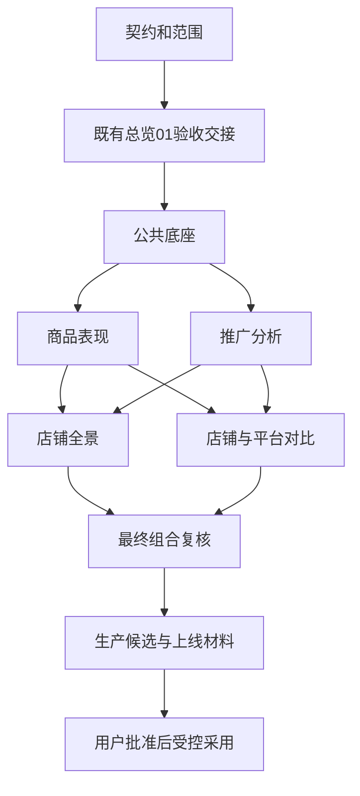

# 网店分析开发波次与主线合并顺序

主线合并由I串行执行。并行只发生在互不重叠的工作树、栏目目录和隔离资源中。代码合入main、生产候选准备与正式上线分别验收。

## 合并依赖



总览01本身不依赖新全景、商品或推广页面。它作为前置，是因为本轮已发现原任务正在修改公共文件，而不是要求重新设计总览。

真正执行时先逐项核验前置成果是否已在最新main且证据仍适用。已完成的步骤记录其提交与验收后直接继承，不重复合并或重新开发；文中在途状态只反映编制时刻，不作为永久阻塞条件。

## 顺序与门槛

| 主线顺序 | 内容 | 可并行工作 | 合入前必须取得 |
| --- | --- | --- | --- |
| M0 | 本契约与提示词工作包 | 只读盘点和范围审定 | 文档路径、内容与仓库规范核对 |
| M1 | 既有总览01独立成果 | F做接口盘点；P/A/S/C做内容映射与合成夹具设计，不改公共文件 | O精确干净提交、原01验收、兼容测试、已知缺源；不能拿未提交目录作依赖 |
| M2 | 公共底座与必要旧逻辑修复 | 后续角色读冻结草案 | 共享DTO/日期/身份/覆盖/导航/能力状态冻结；最小组件边界；公共文件转交；相关回归和隔离构建 |
| M3 | 商品表现 | A开发推广，Q复核P | 按已含M2的最新main验证；商品跨期配对、身份、字段可用性、详情和目录回归通过 |
| M4 | 推广分析 | S/C可做界面设计但不以未合入代码为事实依赖 | 更新到已含M3的main；店日配对、归因、来源限制和对象关系通过；P/A共用接口组合通过 |
| M5 | 店铺全景 | C开发对比，Q复核S | 基于已含M4的main；八章节或明确缺源状态、跨域口径与钻取成立 |
| M6 | 店铺与平台对比 | Q准备全系统回归 | 更新到已含M5的main；完整比较集合、加权比例、两期/平台口径和上下文通过 |
| M7 | 最终集成修正与复核 | Q独立检查 | 五栏目、旧路由、01新旧视图、AI上下文/权限、所有组合回归通过；最终精确SHA上构建 |
| M8 | 发布候选与验收材料 | 无真实业务操作 | 当前main干净；全部证据对应候选SHA；按现有准备流程核验，尚不切换运行版本 |
| M9 | 正式采用 | 不与未完成集成混跑 | 用户本次明确上线授权、原维护/备份/恢复/验收流程全部满足 |

默认P先合、A后合，再S先合、C后合，使组合复验顺序明确。若P或A延迟，另一个无依赖角色可先合，但I须更新队列和准确父提交，后续角色仍等两者接口都通过。S/C也可按相同原则调整，不允许把被阻断功能伪装为空实现合入。

M1未完成时，后续角色仍可整理需求、接口消费样例和合成数据，不必全部停工。若01长期未交接，I应提出与其公共文件不重叠的底座子提交并证明隔离；未证明前不得跳过M1直接改原任务文件。

## 并发排程

| 波次 | 活动工作角色 | 此时I的工作 |
| --- | --- | --- |
| 准备 | O完成既有交接；F只读盘点 | 接收用户内容调整、登记资源和文件归属 |
| 底座 | F实现；Q可独立检查冻结合同 | 处理公共接口决策、保护01 |
| 第一并行波 | P与A | 接受共享改动请求，逐项审查、串行合入 |
| 第二并行波 | S与C | 保证P/A接口已落主线，协调多源组合 |
| 收口 | Q独立复核；缺陷回到原角色修复 | 汇总最终SHA及回归，准备候选材料 |

角色总数不要求同时在线。若环境最多4个活动Agent，优先I＋两个栏目＋Q；O尚在占用时减少新角色。不要为了看似并行而开多个Agent同时读写公共入口。

## 每次合并的操作约定

1. I只读确认主工作区和目标分支状态，fetch最新origin/main，记录父提交；不覆盖其他任务修改。主检出有不相关脏文件或正在发生另一项Git变更时，先在独立集成树完成验证和排队，不stash、reset或强行切分支。
2. 栏目分支将最新main合入自己的树并解决语义冲突。已推送/共享分支优先普通merge；不得擅自rebase已共享提交或force-push。
3. I在独立集成树合入候选，复验它与当前main的实际组合。各角色旧SHA测试结果不能替代合并后结果。若合并冲突改变行为，补相关测试。
4. Q检查结果。未处理缺陷明确阻断相应提交；无关已知基线问题须有前驱复现证据，不可直接“忽略”。
5. 满足门槛后，由I把已验证组合推进main并正常push。核验远端main包含交付提交；远端已前进导致push拒绝时，重新同步和复验，不强推。
6. 不把独立角色合并到main后的提交又反复cherry-pick到其他分支；其他角色通过同步main获取依赖。记录使用的是原提交还是显式集成提交，避免重复补丁。
7. 保留旧URL和已实现业务功能。任何新页的接线须同批带齐依赖；main不得引用尚未合并组件或接口。隔离预览入口不能泄漏模拟数据到正式页面。

共同依赖的接口注册/导航接线由I或当前F持有人单独落入明确提交。栏目提供可审查变更请求与自身模块，I完成接线后在该组合上验收；不允许“各Agent都改一点公共文件，最后自动解决”。

## 失败与回退

合并前失败留在分支修复；合并后发现回归，使用新的修复提交，确需撤销时采用经影响审查的revert，不能重写main。依赖已被后续栏目使用时要一起评估，不能只回退底座导致所有消费者失败。

代码revert不等于生产数据库回退。任何生产恢复仍使用当前项目批准的精确恢复点、维护流程与证据；不恢复D1旧源。缺少新数据源的栏目以诚实能力状态交付，不以重导生产数据完成验收。

## 候选和上线分开

M8只执行已获范围内的候选准备，不能调用apply、DeployApp、EnterMaintenance、Stop/Start、生产migrate或业务工作流。准备脚本若有共享固定发布目录，同一时间只允许I使用，并复核既有发布状态，不能多个角色各自生成“最终包”。

M9需按最新 `docs/STARTUP_RELEASE_OPTIMIZATION.md` 及AGENTS执行，包含当前要求的前后备份、恢复校验、版本绑定、组件与页面验收。这里不复制可能过期的命令序列，不把本工作包当未来停服授权。

## 合并记录模板

```text
步骤：M0/M1/...
角色、内容编号、契约版本：
origin/main父SHA：
栏目提交SHA及依赖SHA：
集成后SHA、公共文件持有人：
相关测试、组合回归、构建结果与证据：
Q复核结论、仍受限字段及原因：
push后远端SHA及包含性核验：
候选状态、运行版本状态：
工作树/分支保留原因或安全清理结果：
```
