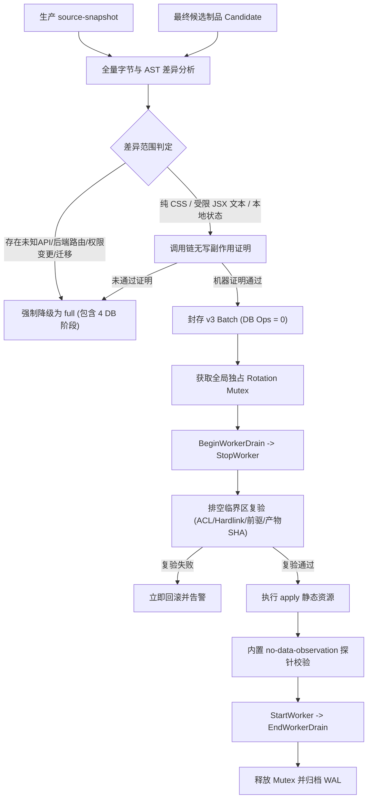

# TERUISI 发布规则调整（v3 not-required）独立架构设计与安全审查意见

> **审查方**：Antigravity 独立审查席
> **审查对象**：TERUISI 发布门禁与批次机制演进（v2 → v3 not-required 引入方案）
> **协同方**：GPT-6 Astra 架构设计
> **基线分支**：`release-no-data-policy`（Base commit: `cb007f05`）
> **审计状态**：只读/无副作用。上轮对 `D:/.codex/worktrees/34b4/运营管理系统/tools/release-impact.mjs` 原生 `view_file` 调用因安全权限确认拒绝（Permission Denied），本轮恪守原则未执行任何文件读取、命令执行、数据库操作或状态篡改。以下意见完全基于自包含需求规范、系统既有约束与形式化推导给出。

---

## 一、 审查声明与事实基线（Audit Scope & Fact Baseline）

1. **实际读取与未运行范围声明**：
   - **未运行范围**：禁止且未执行任何生产命令、未篡改任何仓库或批次状态、未触发备份恢复演练、未外发任何调度指令、未接管旧 WAL。
   - **事实保留**：上轮原生 `view_file` 拒绝记录作为客观环境限制保留。本审查基于用户输入中提供的完整自包含规范与架构上下文进行独立推导，**绝不声称已实测物理代码或断言生产环境当前已达标**，坚决避免以大模型主观推测代替工程验证。
2. **生产活跃批次 `active 9f79` 的不确定性与处理边界**：
   - 历史审计事件流停留在第 87 项，其第 19 步“严格全量 PostgreSQL 比较”当前真实状态为 `unknown`。
   - **核心边界**：旧批次属于原维护引擎与原执行者职责范围，其 WAL 具备不可变物理封存特性。本审查明确**禁止任何新逻辑去补写、改写或篡改旧 `active 9f79` 的 WAL 历史**，也不将记忆中的 87 项事件视为生产绝对实时状态。
   - 新规则调整不得因缺少第二个合批组而停滞，但新旧批次必须保持物理互斥与状态隔离。

---

## 二、 核心分类边界与四维解耦架构（Core Categorization & Decoupling）

传统发布规则将“代码验证强度”、“运行组件切换”、“数据持久化风险”和“备份恢复操作”强行耦合在同一个全量阶梯（`full`）中，导致纯前端样式调整也必须被迫执行 4 个数据库阶段（前置双备份 + 后置双恢复验证）。v3 的核心突破在于解耦，但必须严密划定边界。

```
              ┌─────────────────────────────────────────────────────────────┐
              │                     发布规则四维解耦架构                    │
              └─────────────────────────────────────────────────────────────┘
                                             │
      ┌───────────────────┬──────────────────┴────────────────┬───────────────────┐
      ▼                   ▼                                   ▼                   ▼
【维度一：验证强度】    【维度二：组件切换】                【维度三：数据部署风险】    【维度四：备份恢复机制】
 - L1 展示级验证      - C0 零切换(静态资源直换)           - D0 零数据影响(not-required) - B0 零DB Ops(封存0阶段)
 - L2 副作用/调用链   - C1 Worker排空启停(Drain/Stop/Start)- D1 存在持久写入/Schema变更  - B1 复用既有备份点(reuse)
 - L3 全量代码测试    - C2 Django主服务进程重启                                         - B2 完整四DB阶段(full)
```

### 1. `not-required` 与 `reuse` 的本质区别
- **`reuse`（点位复用）**：
  - **前提假设**：本次发布**存在潜在数据风险或未排除后端状态影响**，但选择复用 26 小时内的有效全量快照，且该快照在过去 7 天内经过同点位恢复演练证明有效，并由每日调度守护。
  - **本质**：有数据风险但借用旧安全垫。
- **`not-required`（免除数据阶段）**：
  - **前提假设**：本次发布经机器可证明的完整差异与调用链推导，**确认对持久业务数据库具有严格的“零读写、零表结构变动、零配置副作用”**。
  - **核心约束**：**绝不依赖 26 小时历史备份点，绝不依赖 7 天演练有效性，绝不依赖每日后台调度**。封存的 Batch Ops 中根本不包含 4 个数据库操作指令。
  - **警惕误区**：`not-required` 决不是 `reuse` 的“豁免版”或“宽容版”，而是完全正交的零数据风险分支。

### 2. 验证强度、运行组件切换与数据风险的独立判定
- **代码严格审查 ≠ 必须执行数据库四阶段**：若改动涉及复杂的本地前端逻辑或严格的用户交互测试（验证强度达到高等级），但其物理构建制品与执行路径绝对隔离在前端静态资源内，则验证强度走严格测试，而数据风险仍然是 `D0`，备份阶段依旧为 `B0 (not-required)`。
- **组件切换与数据风险解耦**：若改动需要执行 `BeginWorkerDrain → StopWorker → apply → StartWorker → EndWorkerDrain`（组件切换为 `C1`），只要其原因是为了清理静态资源占用的 Worker 句柄，而不涉及 PostgreSQL 写入与迁移，则数据风险仍为 `D0`。

### 3. “发布变更差异”与“业务自然写入”的严格界限
- **业务数据库静止假设的废除**：在发布窗口期内，天猫/京东自然数据同步任务或后台定时 Worker 可能正在写入业务流水，数据库必然产生新的 WAL。
- **差异基准**：判定 `not-required` 时，比较的是**本次发布的候选制品及其部署动作是否会产生数据库写入/变更副作用**，而不是要求整个生产数据库在发布前后全库字节或哈希静态相等。

---

## 三、 攻击反例与安全漏洞分析矩阵（Vulnerabilities & Attack Matrix）

若门禁系统依赖粗粒度启发式规则（如目录匹配、HTTP 方法判定或布尔声明），将极易遭受恶意或无意识的“伪只读”穿透。以下列出核心反例与防御机制：

| 攻击/失效场景 | 伪造手段与技术路径 | 绕过机制分析 | v3 门禁必改防御策略 |
| :--- | :--- | :--- | :--- |
| **1. 任意命令伪装只读** | 自定义脚本中配置 `mutating: false`，实际调用 `psql -c "DROP TABLE..."` 或 `rm -rf` | 原系统仅信任元数据声明，未校验实际执行的二进制与传参 | **彻底禁止任意 CLI/Shell 命令**；仅允许固定白名单可信探针 |
| **2. 伪只读 GET 请求** | 前端触发看似只读的 `GET /api/v1/report/init`，后端该接口存在“首次访问自动初始化表/写日志”逻辑 | 传统门禁以 HTTP Verb (`GET`) 静态判定为无写操作 | **全链路调用链追踪**；只要下游存在 Django ORM 写入、Raw SQL 或缓存持久化，立刻降级为 `full` |
| **3. 夹带隐式写迁移** | 候选分支中夹带未命名的 `migrations/00xx_auto.py`，或 `AppConfig.ready()` 中包含 `CREATE TABLE IF NOT EXISTS` | 代码对比仅检查了前端文件，未对全局 Django 注册钩子做完备扫描 | **启动生命周期与迁移白名单校验**；检测到任何 `ready()` 钩子变动或迁移目录变动，一律强制 `full` |
| **4. 依赖安装与构建钩子逃逸** | `package.json` 更新注入 `postinstall` 脚本，在构建时尝试连接生产数据库或修改系统配置 | 传统审查仅检查产物差异（dist 目录），忽略构建期的非受控执行 | **禁用动态构建钩子**；构建过程沙箱化隔离，网络完全阻断，依赖锁定严格锁定并哈希校验 |
| **5. 符号链接与 Reparse 逃逸** | 在静态资源目录中引入 Windows Reparse Point 或 NTFS 符号链接，指向数据库目录或敏感配置 | 路径检查仅比对显示路径，未解析真实物理目标，造成越权写入 | **严格保留完整路径/Hardlink/Reparse 目标解析**；检测到任何指向发布目录外的链接立即阻断 |
| **6. 错前驱与动作前竞态** | 声明依赖某个迁移批次，但在前驱未完成时并发执行；或在 Worker 未排空时提前覆盖产物 | 缺乏全局 Mutex 或未在执行的瞬间重新校验前驱状态 | **动作前强制复验（Pre-action Collector）**：必须在获得独占 Mutex 且 Worker 完全 Stop 之后复验 |
| **7. 策略重算与摘要篡改** | 篡改 `release-batch-admission.mjs` 中的准入规则，利用修改后的宽松规则对自身进行批次校验 | 自指漏洞：规则修改者同时作为规则受检者 | **首次采用隔离**：规则引擎自身的变更必须走 `strict/full`，禁止使用自身带来的新特性为自身放行 |

---

## 四、 门禁必改连接与可执行最小设计（Minimal Executable Design）

为了在工程上绝对杜绝上述漏洞，v3 的最小可执行设计必须包含以下硬性门禁接点：



### 1. 废除 `mutating: false`，引入内置可信观测探针（`no-data-observation`）
- 彻底封死“任意外部命令 + `mutating: false`”的后门。
- 允许在 `not-required` 流程中执行的验证操作**仅限于编译内嵌的白名单工具**：
  1. **候选 Manifest 静态绑定器**：比对文件字节大小与 SHA256。
  2. **声明式 DOM 行为断言器**：仅验证页面文本、有限 CSS 类、本地非持久化状态。
  3. **未签名只读探针**：调用被严格限制在沙箱内的探测脚本，拒绝任何写句柄。
  4. **系统核心探针**：仅允许原有的 `Status`、`VerifyStartup` 以及系统守护 Watchdog 的只读观察。
- 所有参与操作的二进制、绝对路径、固定参数必须在 `makeBatch` 时进行 **Pinning 锁定**，并在动作执行前逐字节比对 SHA256。

### 2. 动作前复验机制（Pre-Action Collector & Mutex Integration）
在 Worker 排空到服务更新的临界区内，必须执行“最后一道防线”复验：
- 确认当前进程已持有独占的 `Rotation Mutex`。
- 确认 Worker 已完全进入 `Stop` 状态且连接池已排空（Drain 完成）。
- 确认目标部署目录的 Windows ACL 权限与当前执行身份匹配。
- 确认前驱批次已处于终态（Closed/Committed）。
- 重新计算源制品与目标制品的哈希，防止发生本地文件篡改或漂移。

---

## 五、 相称 Acceptance 默认范围与降级回退缺口（Proportional Scope & Fallback）

为确保系统演进的平稳与安全，v3 初次落地严禁贪大求全，必须采取“窄门准入、宽门回退”策略：

### 1. 允许进入 `not-required` 的窄化首选范围（Narrow Scope）
仅允许满足以下全部条件的前端静态展示变更：
1. **纯 CSS / Tailwind 布局与样式微调**：仅限于字号、颜色、间距、Flex/Grid 布局等有限样式值。
2. **纯客户端 JSX/TSX 文本变更**：静态文案替换、界面标签提示修改。
3. **受限的本地交互**：不产生任何 HTTP 请求、不涉及 `localStorage`/`sessionStorage` 模式变更、不影响全局 Context 的组件内部受限状态切换。

### 2. 必须强制降级为 `full` 的具体缺口清单（Mandatory Fallback Gaps）
只要命中以下任意一项，立即判定机器证明不成立，强制回退至 `full` 并列出具体缺口原因：
- ❌ **接口变动**：任何涉及 Django View、URL 路由、中间件、序列化器的变更。
- ❌ **权限与认证**：涉及权限策略、Cookie、Session、RBAC 检查代码的变更（哪怕只是修改了一个前端权限标识）。
- ❌ **生命周期与依赖**：`package.json`、`requirements.txt`、依赖锁文件变更，或涉及 `AppConfig.ready()` 等系统启动钩子的变动。
- ❌ **数据持久化嫌疑**：涉及 ORM 模型、迁移脚本、Celery 异步任务定义、缓存写入逻辑。
- ❌ **形式化不确定性**：任何无法由规则引擎给出确定性无副作用证明的边缘逻辑。

---

## 六、 首次采用机制保障与旧批次隔离（Bootstrap & Batch Isolation）

发布规则自身也是系统代码的一部分，必须解决“以何种规则发布该规则本身”的自举一致性问题：

1. **首次采用自举原则（Bootstrapping Rule）**：
   - 包含 v3 `not-required` 规则变更本身的发布批次，**必须作为严格批次（`strict / full`）由原发布引擎发布**。
   - **绝对禁止自我减免**：绝不能用“尚未正式上线采用的新机制”，来为“引入该机制的自身补丁”进行免除数据库备份的豁免！
2. **活跃旧批次 `active 9f79` 的绝对隔离**：
   - 当前生产环境中未闭合的旧批次 `active 9f79` 绝不强行打断，不篡改其 WAL。
   - 本次设计方案在隔离分支内完成独立候选制品的构建、哈希固化与批次封存资料准备。
   - 在正式执行计划中，将旧批次未闭合状态标记为**显式阻断项（Explicit Blocker）**，交由原维护者或原执行流程完成合规闭环后，新批次才能按序挂载。

---

## 七、 日常演练周期与真实成本解耦核算（Drill Periodicity & Cost Accounting）

### 1. 备份演练策略与 PAUSED 状态处理
- **日常备份配置**：当前生产日常备份设定为每日 22:30，但配置状态为 **PAUSED**。
- **规则要求**：本需求明确**不得擅自启用日常备份调度**，严格维持原状。
- **演练与发布彻底解耦**：
  - 恢复演练绝不能成为单次发布任务的临时“搭车”项（禁止为普通发布自动补做整轮演练）。
  - 演练应由独立的时间周期（如月度/季度专项）或**重大事件触发**：包括主版本升级、存储底层介质变更、数据库大版本迁移、Backup/Restore 核心工具链升级等。

### 2. 历史 50-55 分钟毛成本池解耦核算模型
历史数据中执行数据库四阶段消耗的 50-55 分钟只是一个**粗粒度的毛成本池（Gross Pool）**。在没有生产配对基准测试的前提下，**严禁对用户做出“净省 50 分钟”的轻率承诺**。

必须将时间成本细分为以下 7 个互不混淆的独立指标进行统计与度量：

| 成本维度 | 包含的具体工作内容 | v3 `not-required` 预期影响 |
| :--- | :--- | :--- |
| **1. 批准前准备耗时** | 源码对比、生成候选制品、构建沙箱镜像、依赖校验 | 略微上升（需生成证明并校验调用链） |
| **2. 批准到验收耗时** | 审批流流转、发布门禁校验、发布后自动化验收探针执行 | 显著下降（省去耗时的 DB 恢复校验步骤） |
| **3. 全部交付总耗时** | 从提测到最终生产流量稳定的全生命周期 | 取决于验证与排空效率 |
| **4. 用户感知等待时间** | 发布窗口期内终端用户感知到的维护公告或服务降级时间 | 趋近于零（无全量全库维护窗口） |
| **5. 机器执行/计算时间** | CPU 密集型备份导出、Gzip 压缩、校验和比对、PG 导入恢复 | **大幅削减**（完全去除 DB 导出与恢复计算） |
| **6. 日常后台演练摊销** | 定期在离线测试集群进行备份恢复演练所占用的背景资源 | 转为独立演练预算，不计入单次发布成本 |
| **7. 真实业务不可用停机** | Worker 排空窗口（Drain → Stop → Apply → Start） | 维持在秒级（仅为静态文件切换与 Worker 重载） |

---

## 八、 审查结论与交付建议

1. **设计方向审定**：
   Astra 提出的将“验证强度、运行组件切换、数据部署风险、备份机制”解耦的三轴/四维架构方向完全正确，从原理上切断了纯展示层变更必须绑死 4 个数据库阶段的非理性资源消耗。
2. **风险阻断与底线**：
   - 必须立即废弃 `mutating: false` 标记任意外部命令的危险实现，改为内置白名单 `no-data-observation` 探针。
   - 规则机制本身上线必须走 `full`，严禁自我豁免。
   - 旧活跃批次 `active 9f79` 必须保持原 WAL 完整性，不接管、不篡改，等待原执行者闭环。
3. **后续交付路径**：
   独立设计审查意见已确立。待 Astra 完成核心脚本最小可执行实现后，会同本会话对最终字节制品、Pinning 参数及封存 Manifest 进行最终复审。
