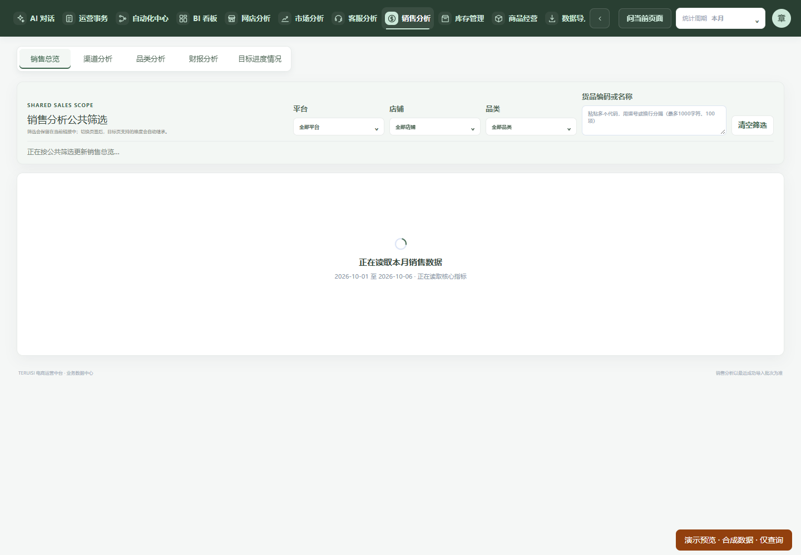
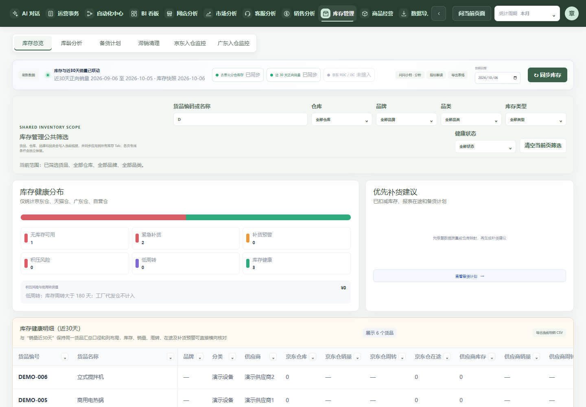
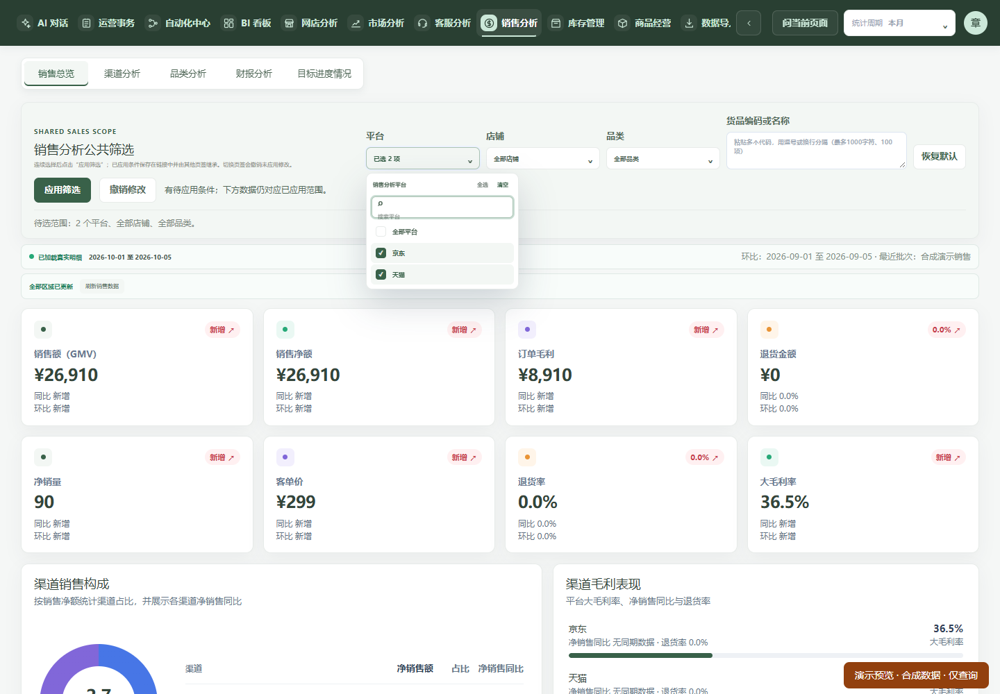
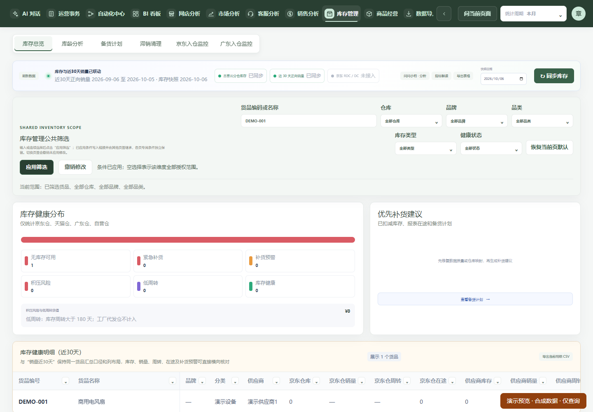

# 公共筛选与货品输入修复（2026-10-06，开发验证）

已完成代码修复和隔离预览，尚未部署。预览：[库存](http://127.0.0.1:3781/?module=inventory)、[销售](http://127.0.0.1:3781/?module=sales)、[商品经营](http://127.0.0.1:3781/?module=product)。均为独立合成数据，只读业务入口。

## 复现与根因

开发基线为 main `c00edc8d`。实际运行回执仍为 Worker `20261006T014342Z-94be344898f54a4b` / manifest `6cc16d73`；四个相关 UI 文件与该 release 的 source-snapshot 逐字节摘要一致。bootstrap current-deployment.json 指向历史起点，不能作为当前 effective release 使用。本轮只读取回执、快照和文件摘要，未调用任何生产生命周期动作。

使用实际 Home、共享控件、全局样式及独立 Django 合成数据接口，给读取增加 1.2 秒延迟，记录原 DOM 节点是否仍连接、焦点、坐标及请求参数：

| 页面 / 字段 | 原版实际表现 | 确定的触发链 |
| --- | --- | --- |
| 销售总览：平台；同组店铺、品类、货品文本 | 选择京东后，原触发器和面板均被移除，焦点丢失，按钮横移 85px；发出 core/full 两次读取 | 选择立即写入应用条件，summary 不再匹配新范围；加载/成功分支把未设稳定 key 的筛选放在不同子节点位置。首次出现清空按钮还改变横向布局 |
| 库存总览：仓库；同组货品、品牌、品类等 | 选择广东仓后原面板被移除；尝试逐字输入 DEMO-001 最终只留下 D，焦点为空，出现 q=D 的 summary/detail 两次读取 | 文本变化立即修改请求范围；加载/成功分支中的筛选 Fragment 位置不同，导致重建。货品字段与多选属于同一根因 |
| 商品经营：平台、店铺、品类 | 面板未被移除，但选一项后触发器立即 disabled，无法继续选择 | 每次选择立即改变 bootstrap scope；新的 scoped overview 尚未返回，依赖筛选 fieldset 被禁用 |

共享 SearchableMultiSelect 原来就没有勾选后关闭的调用。本次证据支持调用方的状态与挂载生命周期问题，没有以时间相关性断言“性能优化是全部问题的原因”。未在真实生产账号/数据上操作这些筛选。

## 修复范围与交互约定

- 共用 `useFilterDraft` 和 `FilterDraftActions`，销售公共筛选、库存公共筛选及商品经营复用同一待选机制。勾选、取消、输入和清空只修改草稿；“应用筛选”一次提交完整条件，再沿原领域读取链刷新数据。没有新增结果缓存或复制查询逻辑。
- URL、AI 页面上下文和业务请求仍只使用已应用条件。提示明确草稿未生效；撤销回到已应用条件，恢复默认先清空当前页适用维度，再由用户应用。其他页不支持的维度保持原值。
- 切换页签撤销未应用草稿，并继承已应用的共享条件；刷新链接恢复已应用条件。日期和排序保留独立语义，财报月份继续使用原有即时读取和稳定面板行为。
- 销售筛选位置固定并设置稳定 key，库存公共 Fragment 设置稳定 key；恢复默认和应用按钮保留固定槽位，避免首次勾选挤动整排控件。
- 商品 `MultiFilterSelect` 复用 `SearchableMultiSelect`，保留原调用接口和多选面板 aria 名称。鼠标勾选保留搜索框焦点；选项 key 仅绑定值。暂缺元数据时仍显示实际已选数量，不能误显示“全部”。
- 平台切换按复合店铺键携带的平台，只移除不兼容店铺；元数据暂缺不作为删除依据。`[]` 代表该维度全部授权范围，店铺为空仍受平台和账号 scope 限制；“全选”显式选择当前可选集合，仍受原选择上限限制。
- 销售和商品只保留同身份/期间的已验证选项元数据供继续编辑，不将旧业务指标冒作新范围结果。商品模块在认证身份变化时重建；原 SQL、权限、店铺隔离、分页、snapshot/revision、请求取消和 generation 门禁均保留。
- 无后端过滤、指标、迁移、权限或缓存协议修改。销售平台/店铺/品类、库存各多选维度、商品平台/店铺/品类仍通过重复参数提交给已有多值过滤器。

## 验证结果

| 验证 | 实际结果 / 边界 |
| --- | --- |
| 实际 Home 隔离浏览器 | 10 组通过，Runtime error 为 0；连续多选、取消、清空、应用、撤销、默认、平台店铺联动、慢请求、失败重试、页签切换和日期取消均覆盖 |
| 货品输入 | 库存六页签、销售总览/渠道/品类的持续输入与多行内容通过；库存 Chrome IME composition/提交、光标中间插入、剪贴板粘贴、删除、清空通过；编辑期间零业务请求，慢请求完成不覆盖草稿 |
| 焦点 / 滚动 | 实际销售面板连续选择搜索框保持焦点、原面板仍连接、几何位置不变；80 项组件夹具验证列表滚动位置、搜索词、三项上限和暂缺元数据时的选择含义 |
| 多值后端范围 | 两个平台完整进入销售 core/full 查询，真实合成接口净销售均为 2,691,000 分；商品两平台进入 initial-page/overview 查询；库存两个健康状态进入 summary/detail，返回各行 status 均在选择集合内 |
| 请求竞态 | 故意让浏览器传输忽略 abort，旧无匹配货品请求迟到仍不能覆盖新有数据范围；请求失败后筛选仍可输入，重试成功 |
| 针对性 Node 测试 | 最终 28/28；包括更新后的财报多选和 100 项货品粘贴测试、新增长列表/草稿行为测试、原 URL/选择上限/财报协调回归 |
| 商品原详情和测算 | 独立 5/5：迟到/错误响应、版本不一致、空覆盖、无效日期/金额、测算页重入均通过 |
| 生产构建 / 边界 / lint | 独立 worktree 构建成功，backend-boundary 无违规；全库 lint 0 errors / 28 warnings，本任务文件定向 lint 无诊断；diff --check 通过 |
| 全库单测首次运行 | 3,320 项：3,286 pass、9 fail、1 cancelled、24 skip，**不是全库通过**。旧财报测试尚按即时生效编写；部分测试缺独立 Python 环境；原生进程测试超时；商品测试未收尾，精确核验后只结束本任务卡住的测试进程及其自有临时子进程 |
| 首次失败定向复验 | 更新财报测试按统一应用后已包含在 28/28；补齐本 worktree 的独立测试 venv 后 Python 相关 46/46 + 推广 3/3；原生进程测试 1/1；商品 5/5。没有放宽断言/超时，不反推首次全库当时通过，也未重新冻结执行全库 |

## 可复查材料与未验证事项

[结构化证据](evidence.json) 包含原版节点连接、坐标和查询记录，部署绑定及修复源码摘要。原始响应均为虚构合成数据，保存在本 worktree `.runtime/shared-filter-evidence/`；完整测试/构建日志位于 `.runtime/shared-filter-checks/`。这些目录为本次预览和证据依赖，暂不清理。

可复跑：先按 `docs/ISOLATED_PREVIEW.md` 在独立 worktree 使用 `TERUISI_PREVIEW_PORT=3781` 启动既有预览，然后执行 `node tools/shared-filter-regression.mjs`；工具只接受 3100–3899 的回环预览，不调用生产接口。`tools/shared-filter-probe.mjs` 仅允许原版 pin 且 app 无改动的 worktree；`tools/shared-filter-baseline-input.mjs` 将原版库存文件单独打包，不回退当前修复源码。

未使用真实 Windows 输入法候选窗、其他浏览器/移动触摸设备或真实生产多账号验证；Chrome IME 组合与提交测试不能冒作所有输入法已验收。市场/网店/运营事务等其他使用 SearchableMultiSelect 的页面进行了代码调用检查和全库相关测试，但没有逐个页面重复实际浏览器业务验证；其即时生效接口仍保持原语义。未进行独立非作者审查或生产 PostgreSQL 范围验算，本轮没有更改后端过滤逻辑。

2026-10-06，用户已回复“验收通过”；已验收业务源码为 ed208d3d。生产部署、生产服务启停、生产迁移/回填、真实业务补跑和外部消息均未执行，正式候选尚未准备或采用。[具体上线方案](RELEASE_PLAN.md) 基于只读核对的当前前驱，待独立生产授权；不能复用历史已消费计划。当前源码分支和预览仍为预览及发布材料依赖，暂保留；源码合并不表示生产问题已经修好。
