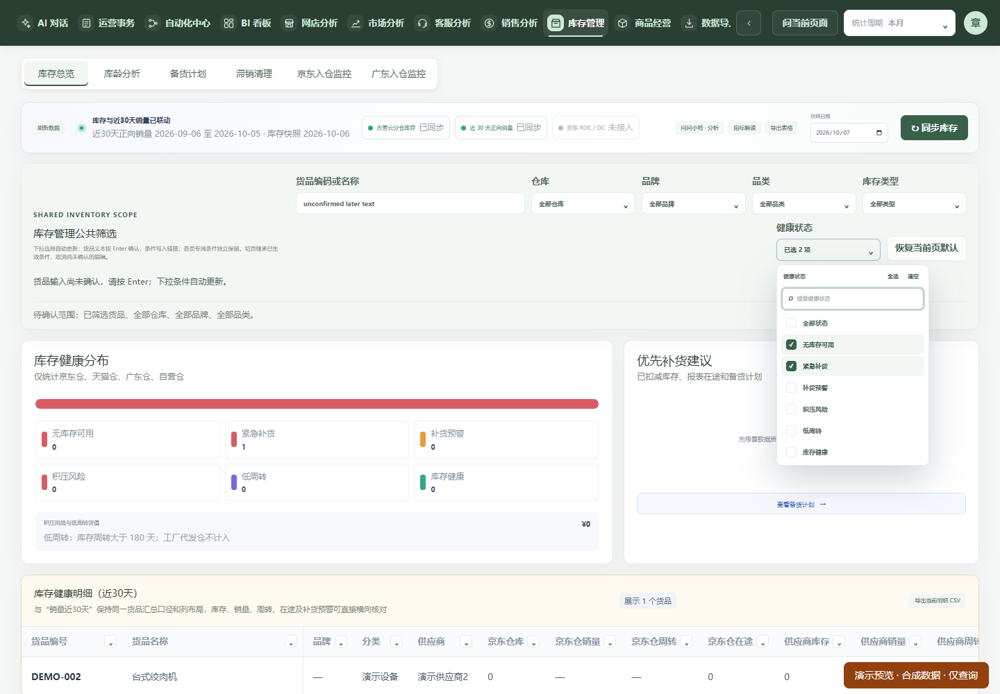

# 筛选确认方式调整：2026-10-07，尚未上线

2026-10-07：用户明确“上线”后，已按当前运行前驱精确组合采用，见 [正式采用记录](../shared-filter-layout-20261007/PRODUCTION.md)。以下保留开发阶段原始状态与限制；开发/main SHA 不等于正式构建来源。

用户先要求取消“应用筛选”，随后明确：文本通过键盘确认键确认；下拉单选或多选后自动加载。已按后一条规则实现，不自动确认未提交文本。

## 最终行为

- 销售、库存、商品经营的货品编码/名称输入框按 **Enter** 确认并查询。粘贴、输入、删除和输入框清空只编辑文本，直到 Enter 才改变查询。销售/商品文本支持 **Shift+Enter** 换行，换行粘贴及原字数/代码数限制保留。
- 中文组合输入进行中的 Enter、`isComposing` 或 `keyCode=229` 不提交查询；组合结束后再按确认键。未把输入法选词回车当成业务确认。
- 公共下拉选择、取消、清空、风险区间及计划状态自动刷新，500ms 合并连续操作。无“应用筛选”或“撤销修改”按钮。商品排序等已有单选即时语义保持，日期仍走原独立确定/取消机制。
- 未确认文本与已生效下拉条件分开：修改下拉只使用上次确认的货品文本，输入框中的新文字不丢失、不被一起提交。提示明确未确认文本不参与查询；恢复默认按钮是明确的清空动作，会统一确认当前页默认条件并清理其附加卡片状态。
- 已生效条件按原方式写入 URL、继承到适用页签。切页、日期/所属身份范围切换或卸载会取消未触发的定时提交；未确认文本不带到其他页。元数据/请求返回不重新计时或覆盖文本，保持原面板 key、焦点和滚动策略。

## 修改范围

复用前轮 `useFilterDraft`，共用自动提交和 Enter/IME 判断工具。调用方分别管理下拉草稿与文本草稿，没有新增查询端点、结果缓存、权限或业务过滤逻辑。商品查询等待已确认文本的原防抖结束，避免同批下拉条件误发上一段文本的请求。

公共筛选字段 CSS 改为只匹配直接外层 label，避免外层输入框样式命中内部下拉搜索框造成重叠。没有扩展其他页面样式或重做 UI。

## 验证

| 检查 | 实际结果 |
| --- | --- |
| 实际 Home 合成环境 | 5 组通过：文本未 Enter 零请求，下拉单选/多选自动查询，完整双平台参数、真实后端行范围，未确认文本保持，慢请求、迟到响应、失败重试及恢复默认/切页取消 |
| 针对性 Node | 最终 32/32：长列表滚动/焦点、连续多选、文本 Enter、IME/229、换行/100代码粘贴、无效文本不请求、财报月份、URL继承、商品详情/测算与旧响应隔离 |
| 全库 Node | 3337 项，3314 pass、1 fail、22 skip、0 cancelled。唯一失败为基线已有静态计数断言：`module-performance.test.ts:99` 预期库存 overview 字符串一次，cf177ad4 基线及本轮均为两次（同期广东计划复用已有第二入口）。未删断言、未宣称全库通过或扩大本轮去重构该功能 |
| 构建/lint/边界 | 隔离构建成功；全库 lint 0 errors/28 warnings，本任务定向 lint无诊断；backend-boundary、diff --check通过。构建前确认3000监听的是受保护不可变 release，不引用077e目录 |

[结构化证据](evidence.json)记录七个修改源码摘要、五组检查及真实合成请求。原始夹具响应/截图保存在本 worktree `.runtime/filter-confirmation-*`，检查日志保存在 `.runtime/filter-confirmation-checks/`。旧 `docs/shared-filter-20261006` 的手动应用及生产材料为历史证据，不改写其结果；新版本复跑使用 `node tools/shared-filter-confirmation-regression.mjs`，仅允许 3100–3899 回环隔离预览。

预览：[库存](http://127.0.0.1:3781/?module=inventory)、[销售](http://127.0.0.1:3781/?module=sales)、[商品](http://127.0.0.1:3781/?module=product)。均为虚构数据、只读业务入口。Chrome composition及键码分支已验证，未重新验证真实 Windows 原生候选窗或其他浏览器/触摸设备；此前原生工具阻止记录保持，不冒作本轮已验收。

本轮只做开发修复、隔离验证、提交推送及预览，未停止/更新生产、未碰固定发布源、未备份或迁移、未补跑业务或发外部消息。开始时只读生产回执为 Worker/helper `20261006T164404Z-05ba8978cfc7b5d4` / manifest `dd1fa68e`（此前客服后继已采用），不再把早先339/e063当最新前驱。源分支保留供 review，生产采用须重新核验届时前驱并另获本次维护授权；不会顺带采用 main 尚未上线的其他功能或复用历史已消费计划。
