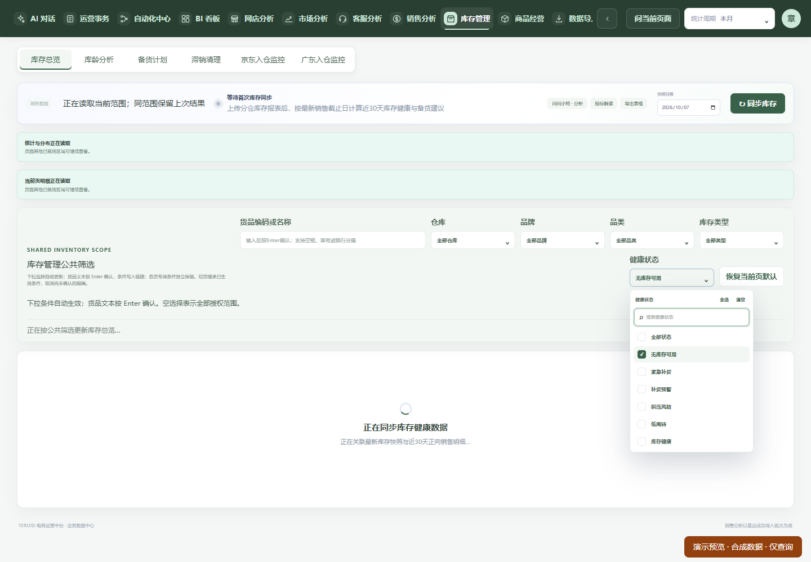
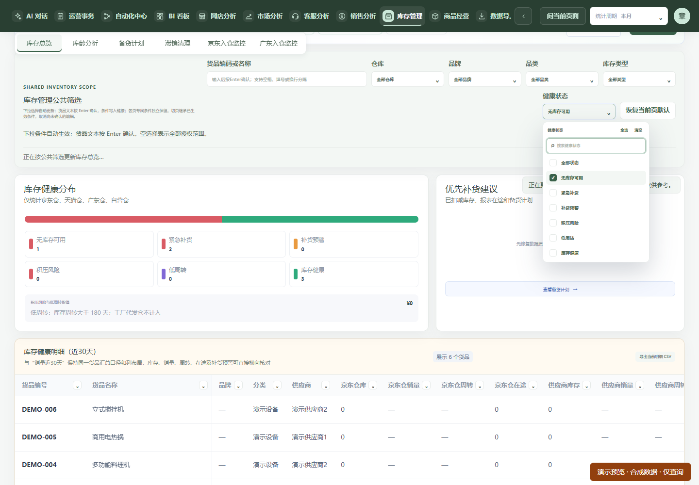

# 公共筛选自动加载时的跳动修复

2026-10-07：用户明确“上线”后，已按当前运行前驱精确组合采用，见 [正式采用记录](../shared-filter-layout-20261007/PRODUCTION.md)。以下保留开发阶段原始状态与限制；开发/main SHA 不等于正式构建来源。

状态：在 `codex/shared-filter-auto-apply` 已完成的 Enter/下拉自动确认成果上增量开发；隔离预览可查看，未合 main、未采用生产。保留原日期独立确认、权限、店铺身份、分页、响应范围和来源版本校验。

## 实际复现与根因

对上一开发源码 `7d1bd256` 的实际 Home 页面，使用只读隔离后端及 1440×1000 Chrome，在业务读取中加入 1300ms 延迟，逐帧记录文档高度、滚动位置、触发器/菜单坐标和 DOM 连接状态。选择后菜单仍连接，但旧数据被短加载状态替换，文档缩小导致浏览器上移滚动位置；库存另在筛选前插入统计/明细加载提示。不是本轮预先归因于性能优化，也不是再次因菜单卸载关闭。

| 页面 | 修复前文档高度 | 修复前 scrollY | 修复后同场景 scrollY / 触发器纵坐标 |
| --- | --- | --- | --- |
| 销售总览 | 1905 → 1000 | 130 → 0 | 恒定 130 / 81.80px |
| 库存总览 | 1376 → 1000 | 130 → 0 | 恒定 130 / 213.59px |
| 商品经营 | 1176 → 1082 | 130 → 82 | 恒定 130 / 450.97px |

财报费用面板另有 `overflow:hidden` 裁切月份弹层的问题：操作弹层可让面板内部 scrollTop 改变，随后高度变化又重置该滚动，造成月份触发器约 128px 移动。针对真实财报组件分别验证上下两个月份入口，保留失败样本后修正该处裁切。

## 修改范围及行为

- 新增共享 `StableReadContent`：仅保存最近一次完整成功的展示节点。在同一页签、日期和认证对象内，新条件读取时保留外观，使用明确的更新提示；保留内容 `inert` 且 `aria-hidden`，不能用旧行操作或将旧值写入新请求。
- 仍由原调用方使用当前完整请求身份及来源版本判断数据。展示快照不进入计算、导出、AI 上下文或后端查询，也不放宽缓存/权限校验；错误撤销展示快照，账号对象或日期改变同步停止使用旧快照。原调用方已经验证为当前相同范围的数据和失败反馈，继续遵守原规则。
- 加载时为当前视口保留必要最小高度，避免较短的新结果或错误提示使滚动位置被浏览器夹到顶部；不强制滚动，不给整页加变暗/淡入动画。日期或身份改变清除高度保护。
- 销售总览/渠道、品类、财报、库存总览/库龄/备货/滞销/京东入仓，以及广东入仓、商品经营复用展示组件。库存区域状态移到公共筛选下方；商品统计失败提示也移到筛选下方。筛选、财报两处月份入口、管理表单和弹窗保持独立的当前状态，库存操作弹窗不加入展示快照。
- 财报费用面板允许月份弹层向外展开；费用表自己的滚动容器保持。财报指标区和库存同步栏另保留必要区块高度，避免其下方筛选在失败时移位。
- 下拉仍自动加载并合并连续选择，货品输入仍按 Enter 确认；未确认文本、中文组合输入、清空/恢复默认和 URL 行为沿用已完成修复，没有复制第二套筛选请求逻辑。

## 验证结果

- **实际 Home 逐帧检查 9 组通过**：销售总览/渠道/品类/财报，库存总览/备货计划单选/库龄，广东入仓品牌多选，商品平台多选。覆盖 1300ms 慢请求、选择及取消自动刷新；触发器持续连接，滚动与触发器/多选菜单坐标变化小于 1px，多选菜单持续展开且搜索保持焦点。广东场景为 89px 原始可用滚动高度，其余为 130px。
- **原确认规则的实际 Home 5 组通过**：完整多值参数、真实隔离后端行范围、未 Enter 不请求、连续输入/光标、中间插入、粘贴及删除、浏览器 composition/229、下拉不提交未确认文本、单选、恢复默认、切页取消、旧请求迟到及失败重试；销售迟到/失败/重试全过程的输入节点、纵坐标和页面滚动逐帧稳定。就绪断言改为只检查非保留区域，防止把上次的成功提示误当新读取完成。
- **最终针对性 43/43 通过**：新增展示组件验证旧节点持续连接、旧操作不能触发、短成功结果不夹滚动、部分结果不能替换完整快照、失败重试不能复活旧快照、同 JSON 新认证对象及新日期清除快照；财报上下两个实际月份入口在读取和失败时几何稳定；原商品详情、测算、分区版本变化和取消/失败组合、权限网关测试保留。
- 隔离构建、定向 ESLint、后端边界检查和 `git diff --check` 通过。未重复运行本轮全库；上一步全库 3337 的 3314 pass / 1 已有静态计数失败 / 22 skip 记录保持，见上一交互报告，不宣称全库全绿。

广东入仓的隔离库没有监控候选项，原直接检查因无第二候选而停止；随后只对该只读路径提供明确的合成分区契约响应，验证真实界面的布局，未写入清单。**该项不代表广东真实后端业务范围已验收**。财报真实 Home 是隔离演示范围，上下月份有数据/错误的验证另由完整契约夹具支撑。滞销、京东入仓复用父组件及分区测试，但未逐项实际 Home 带数据交互；Windows 原生候选窗、其他浏览器及移动设备未实际验证。此前原生工具阻止记录不改写。

## 修复前后证据与预览

库存旧版加载时筛选被推下、正文缩成加载卡片：

修复后原正文暂留并明确标记更新，下拉与筛选保持位置：

[结构化对照](evidence.json)包含各组坐标、范围请求及修改摘要；原始逐帧记录、失败样本和截图在当前 worktree `.runtime/filter-layout-*`。销售/商品的前后加载截图同目录保存。

可查看只读合成预览：[库存](http://127.0.0.1:3781/?module=inventory)、[销售](http://127.0.0.1:3781/?module=sales)、[商品](http://127.0.0.1:3781/?module=product)。复跑入口 `node tools/filter-layout-probe.mjs`、`node tools/shared-filter-confirmation-regression.mjs` 只允许隔离回环地址。

本轮未部署、未启停正式服务、未触碰固定发布源、未迁移或补跑业务、未发送外部消息。若采用，应先复核届时实际运行来源并精确组合这两次交互增量，不直接采用 main 的其他候选功能，不复用旧消费计划。先验收本次不跳动的预览，再提出本次受控上线窗口；此前上线授权不冒作新增维护许可。
