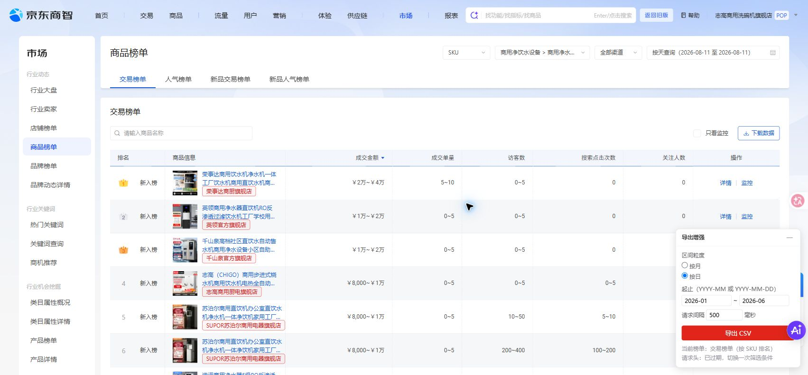
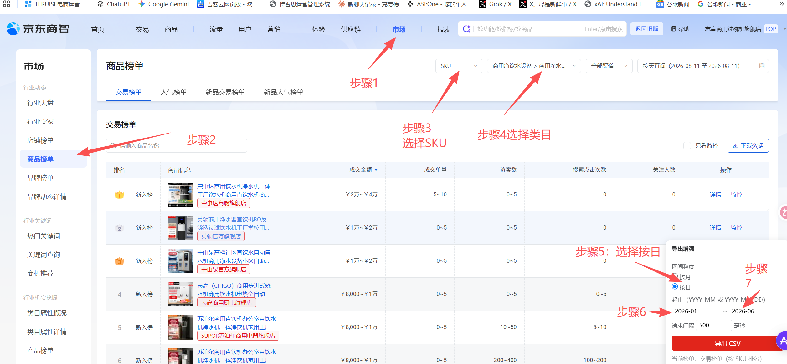
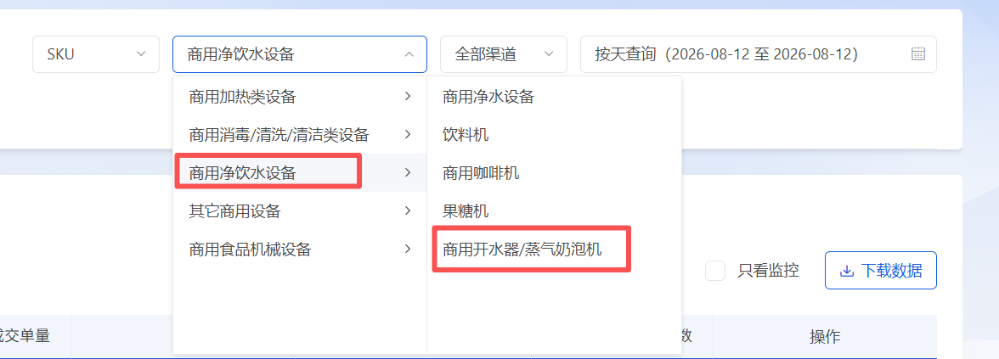
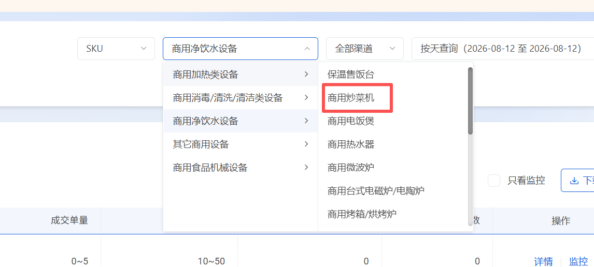
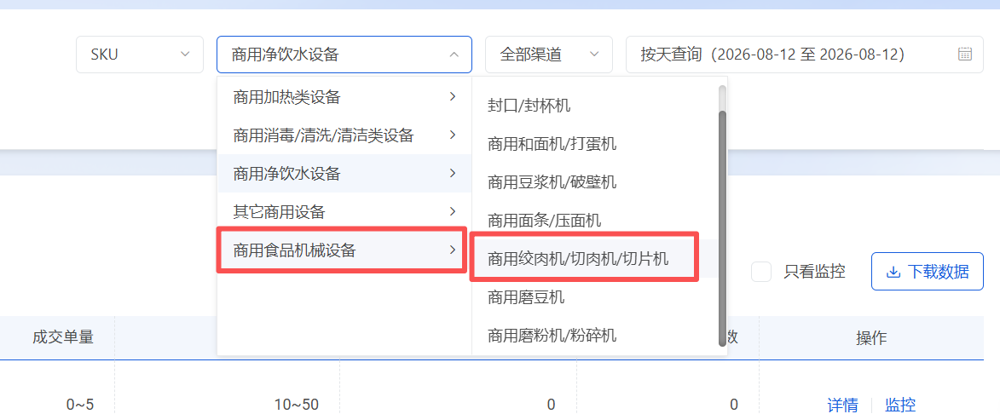
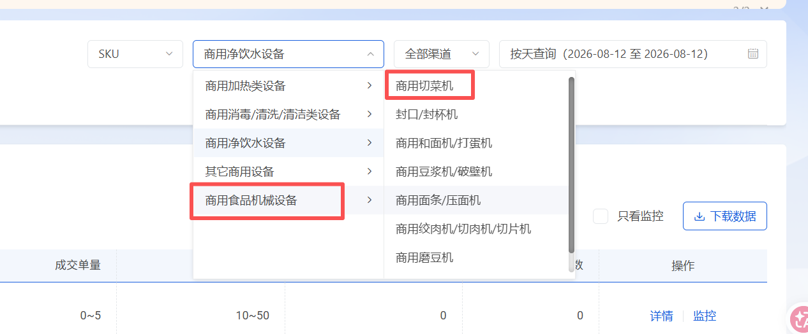
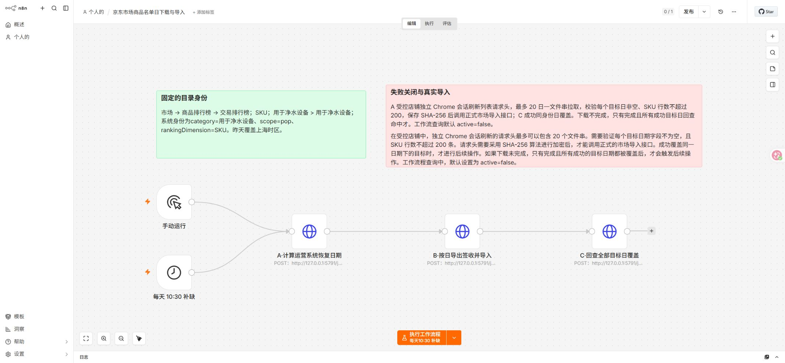

# 京东市场商品榜单 SKU 日数据 n8n 工作流

## 目标与固定身份

该工作流用于补齐运营管理系统中京东商智市场商品榜单的缺失日，固定公共身份如下：

- 页面：市场 → 商品榜单 → 交易榜单
- 榜单单位：SKU
- 系统身份：每个类目独立使用 `category`，公共身份为 `scope=pop`、`rankingDimension=SKU`、`priceBandFilter=全部`
- 数据截止日：上海时区的昨天
- 受控店铺：`jd-cuizhiwang-dengweizhang`；注册表唯一映射为“志高商用洗碗机旗舰店 + `Profile 3` + 调试端口 `9227`”，执行前必须从页头商城链接同时核验店铺名和 `shopId=711743`
- 浏览器模式：`silentNoWindow=true`；使用普通有头 Chromium 离屏运行并持续隐藏 Windows 顶层窗口

工作流不固化运营系统的当前截止日，而是每次运行都调用只读日覆盖接口重新计算真实缺失日。

页面类目与运营系统标准类目映射如下；页面名称中的斜杠不会直接作为系统类目或文件名：

| 顺序 | 京东页面类目路径 | 运营系统 `category` |
| --- | --- | --- |
| 1 | 商用净饮水设备 → 商用净水设备 | 商用净水设备 |
| 2 | 商用净饮水设备 → 商用开水器/蒸气奶泡机 | 商用开水器蒸气奶泡机 |
| 3 | 商用加热类设备 → 商用炒菜机 | 商用炒菜机 |
| 4 | 商用食品机械设备 → 商用绞肉机/切肉机/切片机 | 商用绞肉机切肉机切片机 |
| 5 | 商用食品机械设备 → 商用切菜机 | 商用切菜机 |
| 6 | 商用消毒/清洗/清洁类设备 → 商用洗碗机 | 商用洗碗机 |
| 7 | 商用食品机械设备 → 商用磨粉机/粉碎机 | 商用磨粉机粉碎机 |

## 页面操作对应关系

下图对应“市场 → 商品榜单 → SKU → 选择受控类目 → 导出增强 → 按日 → 起止日期 → 导出 CSV”的人工步骤。自动化执行时不会依赖人工填写的旧日期，而是把运营系统逐类目返回的缺失日写入同一份计划。

用户提供的标注版步骤图：

新增类目的页面选择证据：

## n8n 流程

当前发布调度使用仓库模板 `automation/n8n/jd-market-ranking-daily.chromium-silent-copy.workflow.json`，工作流 ID 为 `JdMarketSilentCopy2026`，上海时区每天 10:00 触发，同时保留手动触发入口。A/B/C 三个节点均固定发送 `X-TERUISI-JD-SILENT-NO-WINDOW: 1`，后端配置也固定 `silentNoWindow=true`。仓库 JSON 为安全起见仍保持 `active=false`，本机 n8n 实例在核验后单独发布并启用；未激活的主模板 `JdMarketDaily2026` 不得同时启用。Codex 定时任务只监控 n8n execution、修复异常和发送钉钉通知，不再直接调用 helper 执行 A/B/C。

三个阶段通过一次性本机环回 helper 串行执行，并绑定同一个 n8n execution ID：

1. A·计算运营系统缺失日期：对 7 个类目逐一调用 `/api/market/daily-coverage`，按完整业务身份读取日覆盖，计划范围从配置起始日到上海时区昨天。
2. B·Profile 3 隐藏导出签收并导入：从店铺注册表解析 `Profile 3`，以普通有头 Chromium 离屏启动并持续隐藏顶层窗口；不允许复用未受本轮窗口守护和执行锁控制的旧实例。精确核验店铺后按配置顺序逐类目执行，每个未完成分块前都捕获当前类目的新鲜、精确二三级类目请求，读取失败只允许刷新一次且不会重放导入。页面存在唯一“导出增强”面板时额外核验“按日”和日期读回并保存面板截图；新 profile 未安装该辅助扩展、面板为零时直接使用已经捕获的京东原生榜单请求逐日拉取。每个目标日必须非空且最多 200 行；每份 CSV 最多包含 5 个缺失日（最多 1,000 行），保存文件大小和 SHA-256，并重验身份、日期和行数后调用正式市场导入接口；仅接受严格的 imported/duplicate completed proof。
3. C·回查全部目标日覆盖：逐一重新校验各类目已签收文件的路径、大小、SHA-256 和导入 proof，再按同一身份查询原计划的日覆盖。任一类目的原目标日仍缺失即失败关闭。

执行证据会保存在 `outputs/jd-market-ranking-daily/<runId>/evidence/`：每个有缺失日的类目分别尝试保存筛选身份、按日缺失区间和导入后页面 PNG，文件名前缀为稳定的类目任务 key。隐藏窗口截图限定为 5 秒；截图超时会删除不完整图片并把有界错误写入计划的 `evidenceWarnings`，但不会替代或阻断更强的原文件 SHA-256、正式导入批次和落库覆盖证据。输出目录与计划文件均为运行产物，不提交 Git。

A、C 节点超时均为 15 分钟，B 节点最长允许 6 小时。单个市场导入请求最长允许 15 分钟，覆盖查询最长允许 2 分钟；实际文件进一步收紧为最多 5 日、最多 1,000 行的受控分块，避免高行数文件触发本地 Worker 的长连接上限。

## 安全和恢复规则

- 工作流只调用 `127.0.0.1:5791/jd-market/*` 和本机运营系统，不保存京东/n8n Cookie、账号、密码、Token、Session 或 profile 路径。
- A 阶段把注册表解析出的非敏感 `profileName + debugPort` 固化到计划；B 阶段再次读取注册表并逐项比对，Profile 发生漂移时失败关闭。
- helper 对跨 execution 接管、并发、空 ID 和乱序请求失败关闭；每轮退出后由现有本地 Worker 启动器重新待命。
- 事实已提交但响应丢失时，新的 n8n execution 必须从 A 开始，只能接管同身份唯一的 `planned`、`failed` 或 `executed` 未闭环计划；已有签收文件先严格重验并精确重投，`running`、多候选、身份漂移或损坏 proof 都失败关闭。
- “导出增强”面板是可选辅助界面：零个时使用京东原生榜单请求，超过一个时按页面注入歧义失败关闭；不得因面板缺失跳过按日数据、文件或导入校验。
- 类目清单在 A 与 B/C 之间发生变化、类目切换后没有捕获到新请求、请求头缺失或过期、店铺身份不一致、目标日空榜、单日超过 200 行、文件变化、导入未完成或任一类目覆盖回查失败都会停止整轮。
- 月级范围锁仍用于阻止按日补齐与同月整月导入并发；事实替换只删除本轮暂存数据包含的精确日期与身份，因此补一个日期不会删除同月其他日期。
- 已下载不等于完成；只有文件签收、正式导入批次完成和全部目标日落库回查均通过才算成功。

## 启用注意事项

主模板和静默副本不能同时启用。加载新版 5791 helper 后，先保持静默副本未激活并手动运行一次，确认 A 返回 `silentNoWindow=true`、B 使用 Profile 3 且 C 完成全部类目覆盖回查，再发布并启用每天 10:00 的定时触发器。Codex 监控任务不得直调 helper；发现执行失败后先诊断和修复，再从 A 触发新的完整 n8n execution。若 10:00 时京东昨日数据尚未开放，必须保留原日期范围，每 10 分钟用新的 n8n execution 从 A 安全重试，不能直接重试 B、缩短日期范围或导入空数据。
